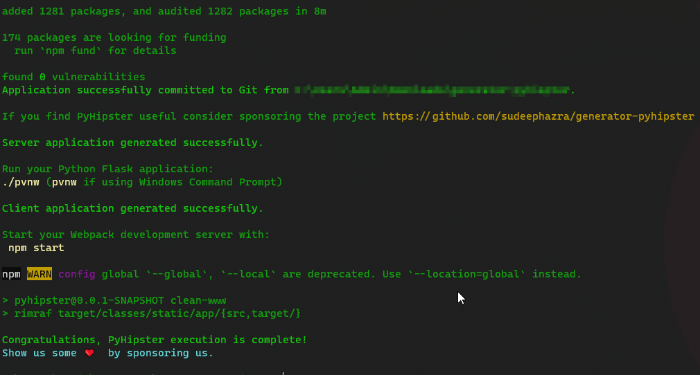
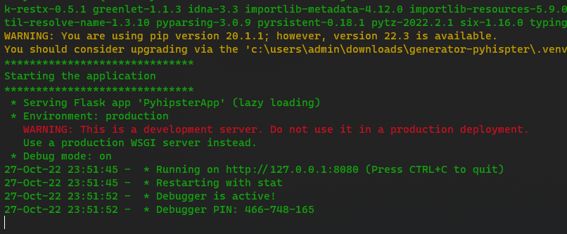
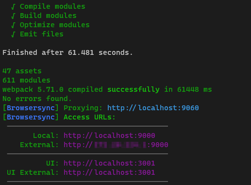
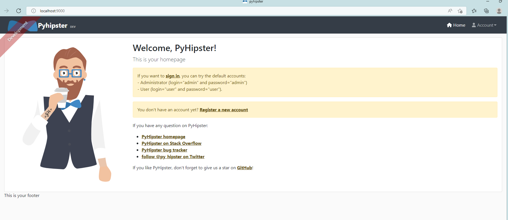

# PyHipster

Greetings, Python Hipsters!

PyHipster is a full-stack Python Flask web application generator. 

> PyHipster is an adaptation of JHipster for Python. A big thanks to [Julien Dubois](https://www.julien-dubois.com/) and the entire [JHipster](https://www.jhipster.tech/) team for this wonderful tool. The current version of PyHipster is forked from JHipster 7.8.1.

The current version of the tool is available as an alpha release and not suitable for production deployment.

## Features
- Python 3 Flask backend
- Angular/React/Vue frontend
- JWT Support
- Integrated User Management
- SQL Databse Support
- CRUD operations using user defined data model
- Multilingual
- Email integration
- User Management

## Technology Stack
### Frontend
Single Web page application:  
- Angular or React or Vue  
- Responsive Web Design with Twitter Bootstrap  
- HTML5 Boilerplate  
- Compatible with modern browsers (Chrome, FireFox, Microsoft Edge)    
- Full internationalization support  
- Optional Sass support for CSS design  

With the great development workflow:
- Installation of new JavaScript libraries with NPM  
- Build, optimization and live reload with Webpack  

### Backend
- Micro web-development framework [Flask 2.2](https://flask.palletsprojects.com/en/2.2.x/)   
- REST API support using [flask-restx](https://flask-restx.readthedocs.io/en/latest/)
- Database integration using [Flask-SQLAlchemy 3](https://flask-sqlalchemy.palletsprojects.com/en/3.0.x/)    
- (De-)Serialization support through [Marshmallow](https://marshmallow.readthedocs.io/en/stable/index.html), [Flask-Marshmallow](https://flask-marshmallow.readthedocs.io/en/latest/), and  [marshmallow-sqlalchemy](https://marshmallow-sqlalchemy.readthedocs.io/en/latest/index.html)    
- JWT token access [Flask-JWT-Extended](https://flask-jwt-extended.readthedocs.io/en/stable/)    
- Email support using [Flask-Mail](https://pythonhosted.org/Flask-Mail/) 

## Limitations
For the current version the tool has certain limitations 
- Only SQLite database support
- No Test coverage for the Python code
- Only monolith support
- No support for Docker

## Requirements
The minimum requirements that need to be installed before we get started are 

 - Python 3.7 
 - Java 11 
 - NodeJS 16 
 - Git 2.3

After this installation, you will need to add the programs to your PATH. Please refer to the guide for 
[Linux](https://linuxize.com/post/how-to-add-directory-to-path-in-linux/) or [Windows](https://www.computerhope.com/issues/ch000549.htm)
### Validating the install
Open your terminal (Linux) or Command Prompt (Windows) and run the following commands to validate your installation.

#### On Windows
``$> python --version``   
``$> git --version``   
``$> node --version``   
``$> java --version``   

#### On Linux
``$> python3 --version``   
``$> git --version``   
``$> node --version``   
``$> java --version``   


## Getting Started
To install the generator run the following command

``npm install -g generator-pyhipster``

Now go to any folder and create the project folder

``$> cd my-dir``   
``$> mkdir my-project``   
``$> cd my-project``   
``$> pyhipster``   

This will start the generator and will ask you a couple of questions to generate the application


Please see below for an explanation of each of these questions.

```
? Which *type* of application would you like to create? Monolithic application (recommended for simple projects)
```
*Explanation* - Currently only monoliths are supported. So you just have this one choice.    
```
? What is the base name of your application? pyhipster
```
*Explanation* - Provide a name for your project
```
? Which *type* of authentication would you like to use? JWT authentication (stateless, with a token)
```
*Explanation* - Currently only JWT is supported. 
```
? Which *type* of database would you like to use? SQL (SQLite)
```
*Explanation* - SQLite is the only supported database for this release
```
? Which *development* database would you like to use? SQLite with disk-based persistence
```
*Explanation* - You have two options here, wither use a desk-persisted SQLite file or an in-memory SQLite instance
```
? Which *Framework* would you like to use for the client? React
```
*Explanation* - You are given a choice to select either Angular, React, or Vue for your frontend
```
? Do you want to generate the admin UI? Yes
```
*Explanation* - Choose "Yes" if you want to enable user management
```
? Would you like to use a Bootswatch theme (https://bootswatch.com/)? Default JHipster
```
*Explanation* - This will enable UI themes from Bootswatch. Please here to [Bootswatch](https://bootswatch.com/) for more details of available themes
```
? Would you like to enable internationalization support? Yes
```
*Explanation* - Choose this option to enable i18n
```
? Please choose the native language of the application. English
```
*Explanation* - Select the base language of the generated code.
```
? Please choose additional languages to install
```
*Explanation* select all the languages that you would like to support.
```
? Besides unittest and Jest, which testing frameworks would you like to use?
```
*Explanation* - Tests are not covered under the current release.

After selecting the options, PyHipster will work to generate the Python and UI code based on your selections.

Once the application is generated, the tool will automatically install all the necessary Node modules. 



We will need 2 terminal/command prompts for running the frontend and backend components simultaneously.

#### Terminal 1 (Backend)
``$> pvnw `` (Windows)   
``$> ./pvnw`` (Linux/Mac)

Once the application is running, we will see the following messages on the terminal   



#### Terminal 2 (Frontend)
``$> npm start ``   

Once the application is running, you will see the following messages.



PyHipster will open your default web browser and point to http://locahost:9000



TODO: Login to the application and use it

## Data Model Definition

The JDL is a JHipster-specific domain language where you can describe all your applications, deployments, entities and their relationships in a single file (or more than one) with a user-friendly syntax.
PyHipster reuses JDL for data model definition as well.

Please find more information abuout JDL [here](docs/jdl.md)

## Customizations

### EMail
To configure your own email to work with the generated application, please go to the file ``src/main/python/config/BaseConfig.py`` and edit the following lines to the appropriate values
```python
# Mail Configurations  
MAIL_SERVER = 'smtp.gmail.com'  
MAIL_PORT = 587  
MAIL_USE_TLS = True  
MAIL_USE_SSL = False  
MAIL_USERNAME = 'my-email-id@gmail.com'  
MAIL_PASSWORD = 'my-email-password'
```
**Please note**: If you use the above configuration with your Gmail password, you might need to  [allow less secure apps](https://support.google.com/accounts/answer/6010255?hl=en). The configuration is simpler but less secure. Also by allowing less secure apps you won’t have the ability to use two factor authentication with Gmail. Therefore we highly recommend you use an app password instead of the Gmail password. Please refer to the Gmail configuration document at [Sign in with App Passwords](https://support.google.com/accounts/answer/185833) for more information on how to set this up.
## Contribution
Please read our [guidelines](/CONTRIBUTING.md#submitting-an-issue) before submitting an issue. If your issue is a bug, please use the bug template pre-populated [here][issue-template]. For feature requests and queries you can use [this template][feature-template].

## Tools
- [JHipster Studio](https://www.jhipster.tech/jdl-studio/) for writing JDL files
- [JWT token validator](https://www.jstoolset.com/jwt) for testing JWT tokens   
- [BCrypt Tester](https://bcrypt.online/) for testing password generation and validation   

