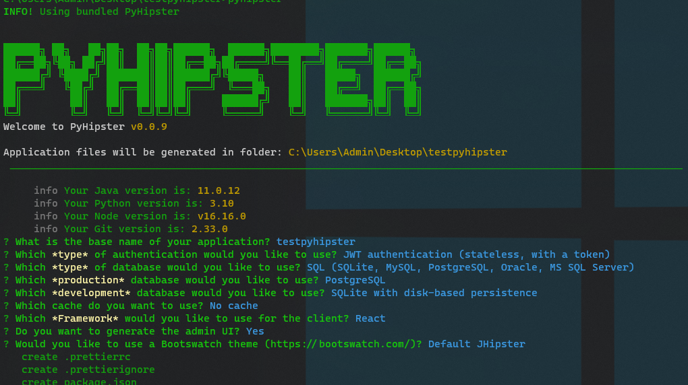
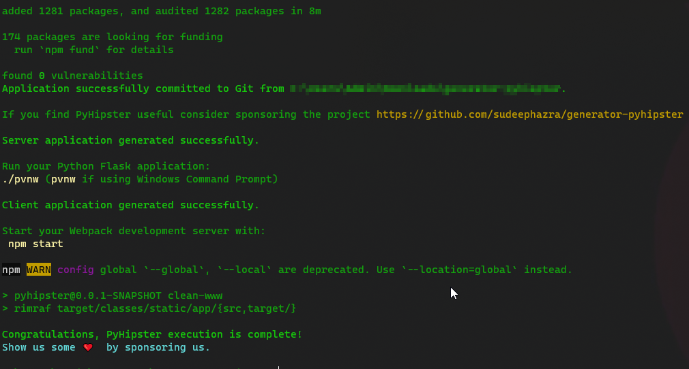
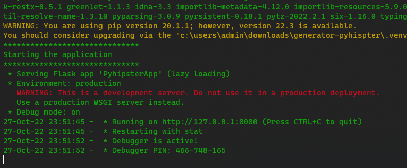
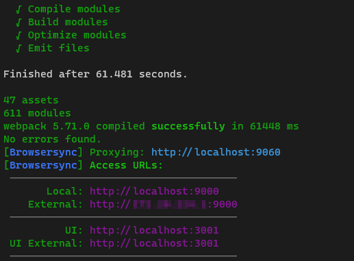
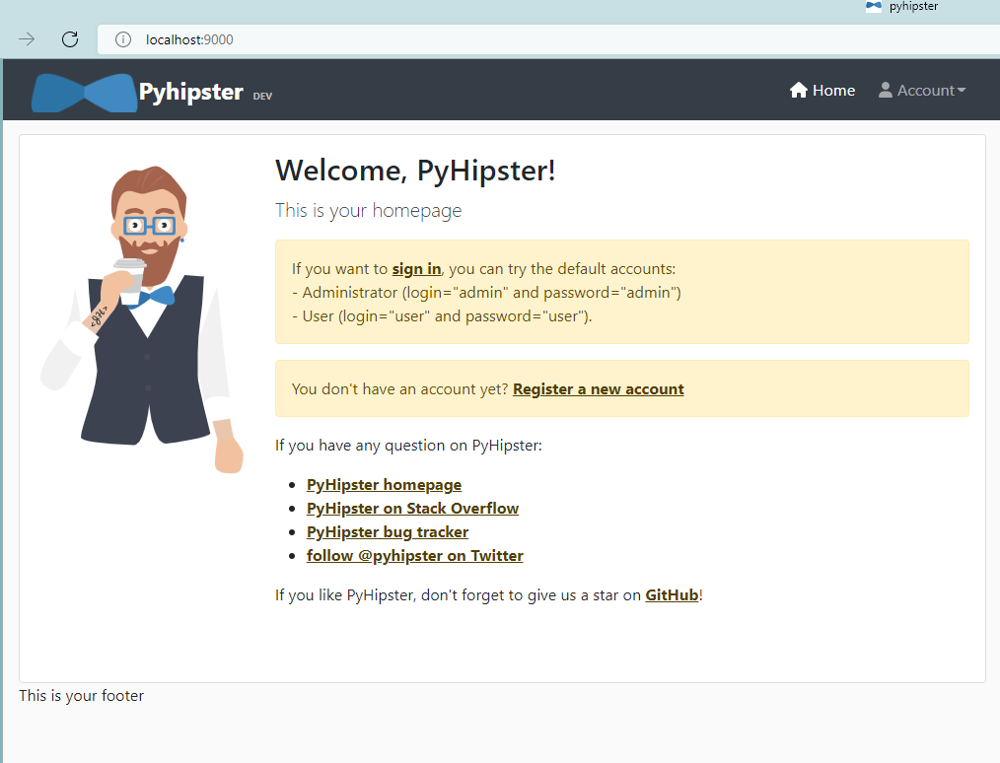
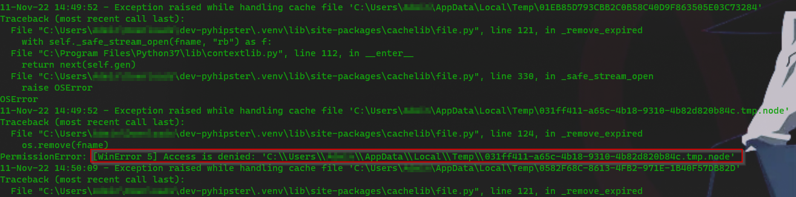

## Requirements
The minimum requirements that need to be installed before we get started are 

 - Python 3.7.9  
 - Java 11.0.12  
 - NodeJS 16.16.0 LTS  
 - NPM 8.11.0  
 - Git 2.33  

After this installation, you will need to add the programs to your PATH. Please refer to the guide for 
[Linux](https://linuxize.com/post/how-to-add-directory-to-path-in-linux/) or [Windows](https://www.computerhope.com/issues/ch000549.htm)
### Validating the install
Open your terminal (Linux) or Command Prompt (Windows) and run the following commands to validate your installation.

#### On Windows
``$> python --version``   
``$> git --version``   
``$> node --version``   
``$> java --version``   
``$> npm --version``   

#### On Linux
``$> python3 --version``   
``$> git --version``   
``$> node --version``   
``$> java --version``   
``$> npm --version``   

## Installing PyHipster
To install the generator run the following command

``npm install -g generator-pyhipster``

## Creating Your First PyHipster Full-Stack Application

Go to any folder and create the project folder

``$> cd my-dir``   
``$> mkdir my-project``   
``$> cd my-project``   
``$> pyhipster``   

This will start the generator and will ask you a couple of questions to generate the application



Please see below for an explanation of each of these questions.

```
? Which *type* of application would you like to create? (Use arrow keys)
> Monolithic application (recommended for simple projects)
```
*Explanation* - Currently only monoliths are supported. So you just have this one choice.    
```
? What is the base name of your application? pyhipster
```
*Explanation* - Provide a name for your project
```
? Which *type* of authentication would you like to use? 
> JWT authentication (stateless, with a token)
HTTP Session Authentication (stateful)
```
*Explanation* - Select the desired authentication mechanism. 
```
? Which *type* of database would you like to use? (Use arrow keys)
> SQL (SQLite, MySQL, PostgreSQL, Oracle, MS SQL Server)
  No database
```
*Explanation* - Select any database type you want 
```
? Which *production* database would you like to use? (Use arrow keys)
> PostgreSQL
  MySQL
  MariaDB
  Oracle
  Microsoft SQL Server
  CockroachDB
```
*Explanation* - Select the kind of database that you would want for the application in production environment. The selection from this stage would be available in the subsequent stages.
```
? Which *development* database would you like to use? (Use arrow keys)
> SQLite with disk-based persistence
  SQLite with in-memory persistence
  MySQL
```
*Explanation* - You have the option to use the embedded SQLite database for development or the database you selected to be used in production from the earlier stage
```
? Which cache do you want to use? (Use arrow keys)
> No cache
  SimpleCache
  FileSystem cache
  Memcached
  Redis
```
*Explanation* - 
```
? Which *Framework* would you like to use for the client? (Use arrow keys)
> Angular
  React
  Vue
  No client
```
*Explanation* - You are given a choice to select either Angular, React, or Vue for your frontend
```
? Do you want to generate the admin UI? Yes
```
*Explanation* - Choose "Yes" if you want to enable user management
```
? Would you like to use a Bootswatch theme (https://bootswatch.com/)? Default JHipster
```
*Explanation* - This will enable UI themes from Bootswatch. Please here to [Bootswatch](https://bootswatch.com/) for more details of available themes

----   

After selecting the options, PyHipster will work to generate the Python and UI code based on your selections.

Once the application is generated, the tool will automatically install all the necessary Node modules. 



We will need 2 terminal/command prompts for running the frontend and backend components simultaneously.

#### Terminal 1 (Backend)
``$> pvnw `` (Windows)   
``$> ./pvnw`` (Linux/Mac)

Once the application is running, we will see the following messages on the terminal   



#### Terminal 2 (Frontend)
``$> npm start ``   

Once the application is running, you will see the following messages.



PyHipster will open your default web browser and point to http://locahost:9000



Follow the onscreen instructions and login as "admin" or "user" and explore around. 

## Data Model Definition

The JDL is a JHipster-specific domain language where you can describe all your applications, deployments, entities and their relationships in a single file (or more than one) with a user-friendly syntax.
PyHipster reuses JDL for data model definition as well.

Please find more information abuout JDL [here](jdl.md)

## Customizations

### Database
The application can handle its embedded SQLite database. In you you selected the database type to be anything other than SQLite, you have to provide appropriate values to the below options in the file ``src/main/python/config/BaseConfig.py``   
```python
# Database     
SQLALCHEMY_DATABASE_URI = '...'    
SQLALCHEMY_TRACK_MODIFICATIONS = False    
PROPAGATE_EXCEPTIONS = False   
```
Please refer to the [SQLAlchemy documentation](https://docs.sqlalchemy.org/en/14/dialects/index.html) for further details.
### EMail
To configure your own email to work with the generated application, please go to the file ``src/main/python/config/BaseConfig.py`` and edit the following lines to the appropriate values
```python
# Mail Configurations  
MAIL_SERVER = 'smtp.gmail.com'  
MAIL_PORT = 587  
MAIL_USE_TLS = True  
MAIL_USE_SSL = False  
MAIL_USERNAME = 'my-email-id@gmail.com'  
MAIL_PASSWORD = 'my-email-password'
```
**Please note**: If you use the above configuration with your Gmail password, you might need to  [allow less secure apps](https://support.google.com/accounts/answer/6010255?hl=en). The configuration is simpler but less secure. Also by allowing less secure apps you won’t have the ability to use two factor authentication with Gmail. Therefore we highly recommend you use an app password instead of the Gmail password. Please refer to the Gmail configuration document at [Sign in with App Passwords](https://support.google.com/accounts/answer/185833) for more information on how to set this up.
### Cache
To configure your cache to work with the generated application, please go to the file ``src/main/python/config/BaseConfig.py`` and supply values for the selected caching mechanism. For example, for Redis cache, you will have the following options to be customized.

```python
# Cache Configurations
CACHE_TYPE = 'RedisCache'
CACHE_DEFAULT_TIMEOUT = 60
CACHE_KEY_PREFIX = ''
CACHE_REDIS_HOST = ''
CACHE_REDIS_PORT = 6379
CACHE_REDIS_PASSWORD = ''
CACHE_REDIS_DB = ''
CACHE_REDIS_URL = ''
```


## Errors
### OSError while using FileSystem cache

#### Cause: This is caused by the filesystem not being accessible for writing to the caching library
#### Resolution: 
- Go to ``src/main/python/config/BaseConfig.py`` 
- Change the following line to any folder that the current user has write access
```python   
CACHE_DIR = tempfile.gettempdir()  
```
 For example, ``/tmp`` (Linux) or ``C:\temp`` (Windows)

## Tools
- [JHipster Studio](https://www.jhipster.tech/jdl-studio/) for writing JDL files
- [JWT token validator](https://www.jstoolset.com/jwt) for testing JWT tokens   
- [BCrypt Tester](https://bcrypt.online/) for testing password generation and validation   
